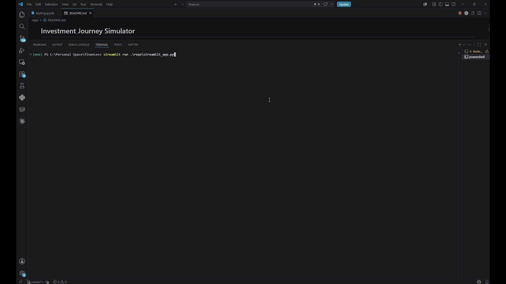
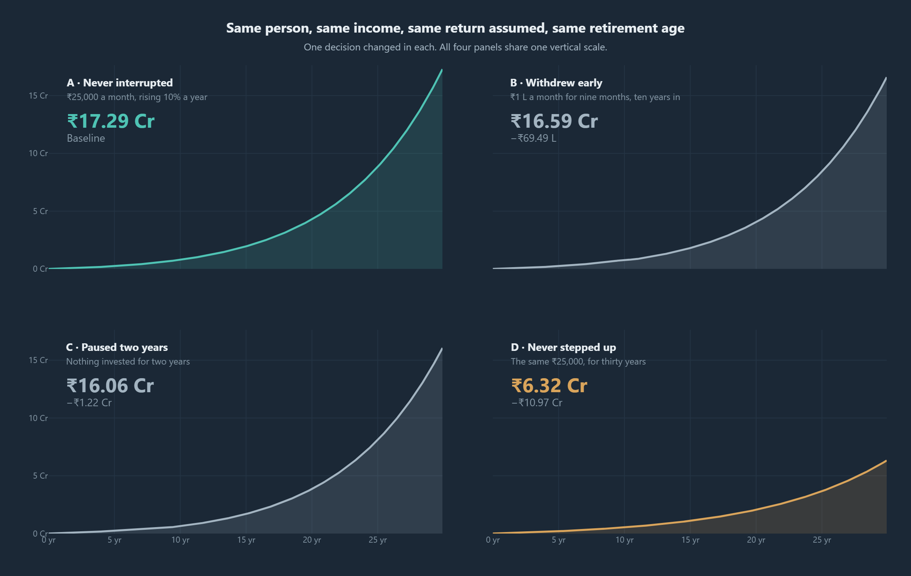
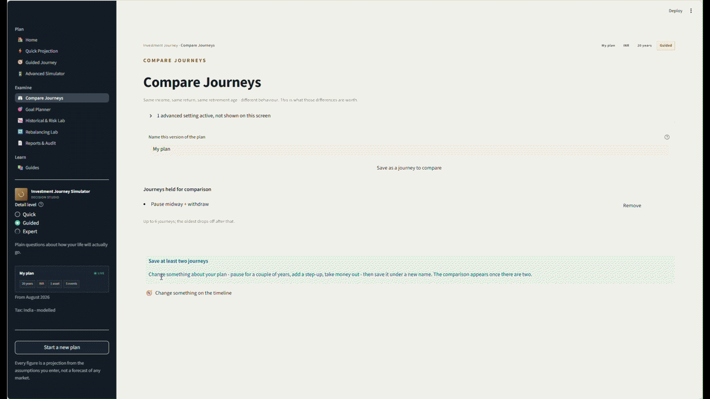
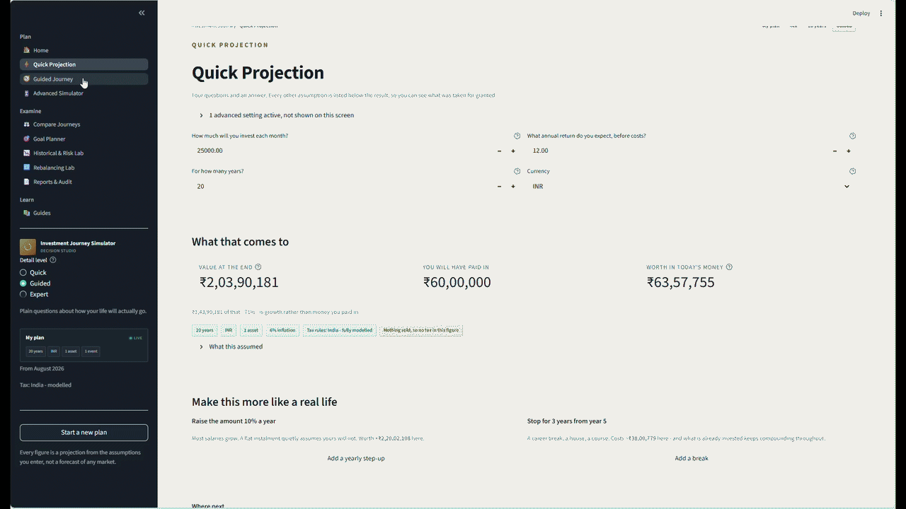
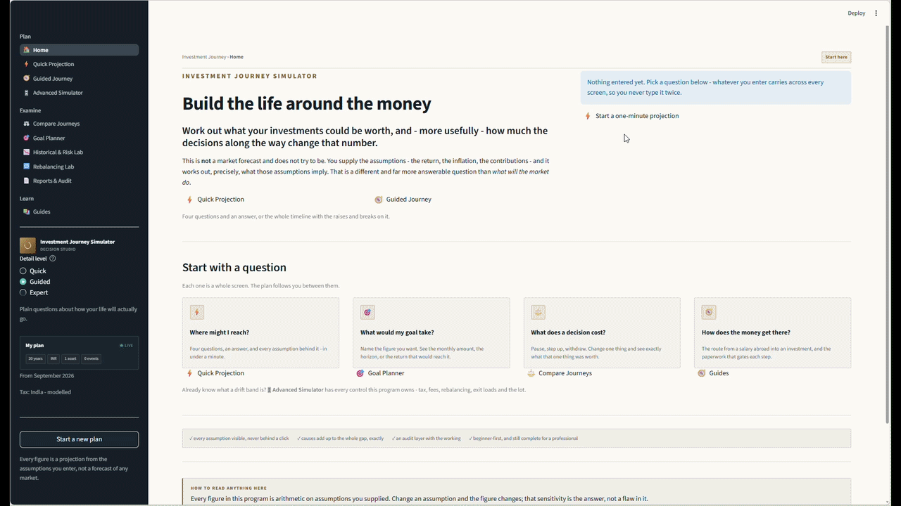
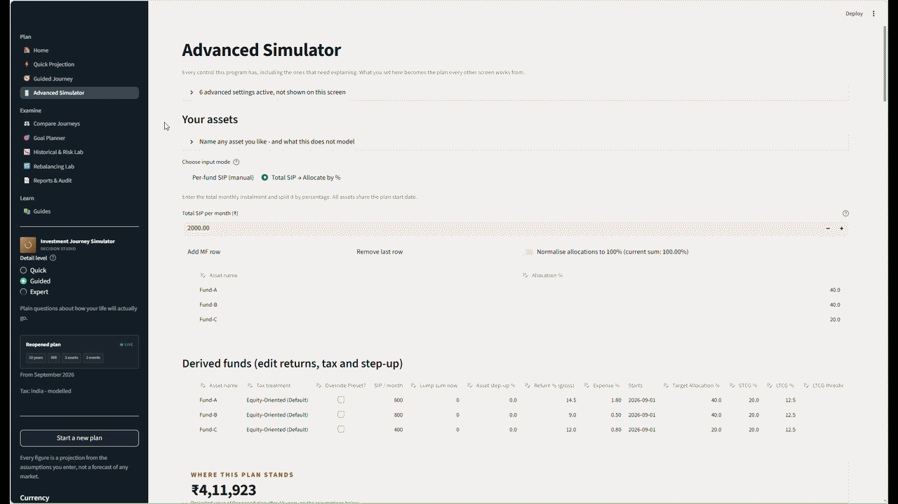
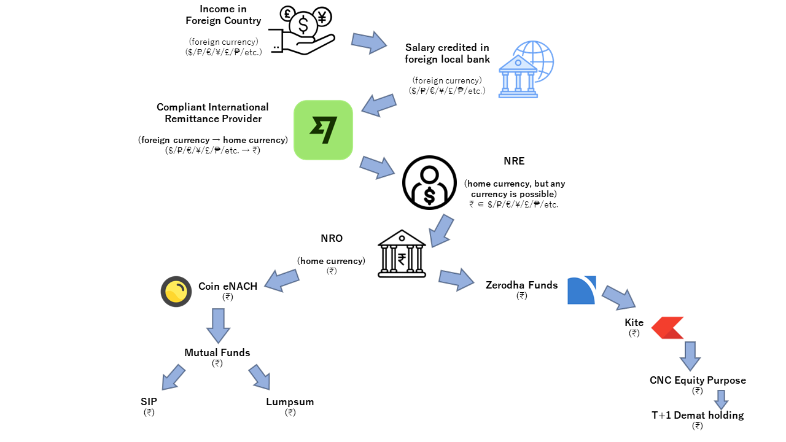

# Investment Journey Simulator

An open-source Python and Streamlit investment planning simulator for SIPs
(systematic investment plans), lump sums, contribution pauses, withdrawals,
tax-aware cash flows, portfolio rebalancing, historical backtesting,
Monte Carlo simulation, goal planning and long-term portfolio outcomes.

**Most SIP calculators will tell you what ₹25,000 a month becomes.
Far fewer will show you what stopping for five years actually
costs.**

*Decisions compound too.*

[](https://github.com/SAMtheROCKET/investment-journey-simulator/actions/workflows/quality.yml)
[](tests/README.md)
[](tests/README.md)
[](pyproject.toml)
[](pyproject.toml)
[](pyproject.toml)
[](LICENSE)



**[Try it online](https://investment-journey.streamlit.app)** · **[Run it locally](#running-it)** ·
**[Documentation](docs/)**

## What you can model

- **SIP and systematic investment plans** with monthly contributions,
  step-ups, pauses, restarts and lump-sum investments
- **Withdrawals and cash-flow timing**, including one-off and recurring
  withdrawals and later investment restarts
- **Portfolio rebalancing** across multiple funds and target allocations
- **Goal planning and goal seek** for required contribution, return or
  investment horizon
- **Historical backtesting and replay** to examine timing and sequence risk
- **Monte Carlo simulation and stochastic scenarios** for uncertainty and
  long-term outcome ranges
- **Tax-aware investment outcomes** for the supported Indian
  resident-individual scope
- **XIRR and post-tax XIRR**, inflation-adjusted values and long-term
  portfolio projections
- **Journey comparison and decision attribution** to explain why two
  investment plans produce different outcomes


---

## Why this exists

> **"Compounding is the eighth wonder of the world. He who
> understands it, earns it; he who doesn't, pays it."**
>
> An old saying with no reliable author, repeated here because the
> sentence is right and because this whole tool is an argument
> that the second half of it is the part people live with. Every
> other number on this page is sourced. This one is a proverb, and
> is marked as one.

Most calculators answer the first question and stop. Far fewer will
show you what a five-year break costs, and fewer still will tell
you *why* two plans ended up apart. That second question is the one
people actually have.



**The top row is the same money, moved.** Both plans pay in exactly
₹45,00,000 over twenty years, and both take five years off. The
only difference is *when*: years 11 to 15, or years 6 to 10. The
earlier break finishes **₹22,83,200 lower** - not because less went
in, but because the missing instalments were the ones with the most
time left to grow.

All four panels are drawn to **one vertical scale**, because
letting each scale itself would make ₹1.48 crore stand as tall as
₹4.02 crore, which is the opposite of the point.

Every figure is real engine output, reproduced with its inputs in
[comparative_journeys.md](docs/launch/comparative_journeys.md).

### When it happens matters more than how much it is

The same rule decides what any interruption costs, and it is worth
stating plainly because it is the one thing a total-only calculator
cannot tell you. Take ₹6,00,000 out of a plain ₹25,000 plan running
twenty years at 12%:

| When the ₹6,00,000 leaves | Ends with | What it cost |
|---|---|---|
| Never | ₹2,03,90,181 | - |
| All at once, in year 16 | ₹1,93,87,901 | ₹10,02,280 |
| ₹5,000 a month, years 6 to 15 | ₹1,86,15,896 | ₹17,74,285 |
| All at once, in year 6 | ₹1,75,44,285 | ₹28,45,896 |

One amount, one plan, and a cost that runs from ₹10 lakh to ₹28
lakh depending on nothing but timing. Notice too that every one of
those costs is larger than the ₹6,00,000 itself: what you spend is
the money, what it costs is the money *and* everything it would
have earned afterwards.

Two things follow, and neither is advice. **Spreading a withdrawal
into instalments costs less than taking it in one go**, because
most of the money stays invested while the rest is drawn down.
**Borrowing instead of withdrawing is the same trade running the
other way**: the corpus keeps compounding and you pay interest for
the privilege, which comes out ahead only if the borrowing rate is
below the return you actually get - and the return is an
assumption, while the interest is a contract. This tool computes
the consequences of assumptions. It does not tell you which of
those to make, and it is not a substitute for a licensed adviser.

---

## What makes it different

Most tools stop at those four numbers. This one explains them:

```
Pause later  →  Pause earlier

  Compounding lost to the pause        ₹-22,83,200
  unexplained                                   ₹0
```

Only one decision changed there, so that split is not hard: the
whole gap has one place to go. **The question worth asking is what
happens when four things change at once** - a smaller instalment,
a weaker raise, a career break and a withdrawal - because then the
causes interact and the obvious method stops working.

[That case is worked below](#when-four-things-change-at-once), and
it is where this becomes more than a calculator.

Every figure above is real engine output, reproduced with its inputs
in [comparative_journeys.md](docs/launch/comparative_journeys.md).

---

### When four things change at once

One decision at a time is not how life arrives. Here is the messy
version: the same person, the same fund, the same assumed return,
thirty years - the plan they meant to follow against the one they
actually followed.

| | Intended | What happened |
|---|---|---|
| Monthly instalment | ₹30,000 throughout | cut to ₹18,000 from year 4 |
| Yearly step-up | 8% | 3% |
| Career break | none | 3 years off, years 8 to 10 |
| Withdrawals | none | ₹40,000 a month from year 13 |
| **Ends with** | **₹14,65,17,397** | **₹2,55,23,470** |

A gap of **₹12,09,93,927**. Now: how much of it was the pause?

### The obvious answer is wrong

Revert one decision at a time and measure each drop on its own:

```
Contributions never made        -₹6,64,01,811
The raise that never happened   -₹6,01,62,317
Money taken out early           -₹2,39,88,128
Compounding lost to the pause   -₹1,65,72,634
                                ──────────────
Sum of the parts               -₹16,71,24,890
The actual gap                 -₹12,09,93,927
                                ──────────────
Unaccounted for                  ₹4,61,30,963
```

**The parts add up to more than the whole**, by ₹4.61 crore. Each
cause measured alone claims interaction effects it only owns
jointly, so the same rupees get counted twice. A pause costs more
when the instalment is larger; a withdrawal costs more when there
is more in the pot to take it from.

Reverting them in sequence instead removes the overshoot and
replaces it with something worse - an answer that depends on the
order you chose. Across the twenty-four orderings of four causes:

| Cause | Smallest | Largest | Spread |
|---|---|---|---|
| Contributions never made | -₹2,53,21,397 | -₹6,64,74,992 | **₹4,11,53,595** |
| The raise that never happened | -₹2,25,47,773 | -₹6,02,40,712 | **₹3,76,92,939** |
| Compounding lost to the pause | -₹62,37,279 | -₹1,65,81,268 | ₹1,03,43,989 |
| Money taken out early | -₹2,39,88,128 | -₹2,41,50,809 | ₹1,62,680 |

Same two journeys, same question, and the cost of the smaller
instalment lands anywhere between ₹2.5 crore and ₹6.6 crore
depending on nothing but which cause you happened to revert first.
There is no honest way to pick one of those and print it as a fact.

### What this prints instead

```
Contributions never made        -₹4,53,02,707
The raise that never happened   -₹4,08,00,147
Money taken out early           -₹2,40,69,421
Compounding lost to the pause   -₹1,08,21,652
                                ──────────────
Total                          -₹12,09,93,927
Unexplained                              ₹0
```

Each figure is that cause's **Shapley value**: its average marginal
effect across all twenty-four orderings. The interaction is neither
dropped nor parked in a mystery line at the bottom - it is shared
out among the causes that jointly produced it, which is precisely
why the column sums to the gap exactly.

That is what the zero means, and it is the only line here that is
not an estimate. `test_attribution.py` asserts it to the rupee on
this scenario, along with every figure in both tables above, so the
numbers on this page fail the build if the engine stops producing
them.

It costs sixteen full thirty-year simulations, two to the power of
the number of causes. That is why the causes are capped at six.

Worked in full, with the inputs:
[comparative_journeys.md](docs/launch/comparative_journeys.md#2b-four-decisions-at-once-which-is-how-life-arrives).



---

## Build a journey by clicking, not by filling in a form

Point at any month on the timeline and it offers to add something
there. Start a SIP, take a career break, resume, step up, buy a car
out of the pot, retire, or sell the lot and close the plan. The
plan is the timeline; there is no separate form to keep in step
with it.

Money leaves the way it actually leaves. A **one-off withdrawal**
takes a single amount out of a single month, and the report shows
what it cost - ₹3,00,000 taken in year six of a ₹25,000 plan is
₹13,62,399 off the final figure, because the money also stopped
earning. **Withdraw everything and close** sells the lot, pays the
tax on the whole gain at once, and leaves the chart flat at zero
for the years that remain, rather than stopping short and letting
you wonder.

And a closed plan can be opened again. Place *Start investing*
after a close and it builds from nothing, because retiring,
spending it and going back to work is an ordinary life.

Impossible sequences are refused as you build, not after you run:
you cannot resume a SIP you never paused, you cannot pause one that
never started, and you cannot spend money out of a plan nothing has
gone into. That is a state machine, not a pile of `if` statements,
and it is why the plan you draw is always a plan the engine can
actually run.



---

## Work backwards from the goal

Say what you want and when. It solves for the monthly amount, and
tells you whether the answer is plausible rather than only what it
is.



---

## Running it

```bash
git clone https://github.com/SAMtheROCKET/investment-journey-simulator
cd investment-journey-simulator
pip install -e .
streamlit run streamlit_app.py
```

It opens at http://localhost:8501. `pip install -e .` also gives you
a command, if you would rather not remember a filename:

```bash
investment-journey
```

Or `pip install -r requirements.txt` for the exact versions the test
suite runs against. Cloning and running `streamlit run
streamlit_app.py` works with no install step at all - the launcher
puts `src/` on the path itself - but you lose the command above.

**That is the only command.** There were once three more launchers -
the classic dashboard, the event rail and the studio - and they were
retired when the portal reached parity with them. Four front ends
onto one engine is four things to keep in step, and three of them
were reachable only by somebody who already knew they existed. None
of the code went anywhere: the classic dashboard runs inside
Advanced Simulator, and the rail runs inside Guided Journey.

There is one other entry point, and it is not a front end:

```bash
python tools/build_rebalancing_report.py    # writes the comparison
```

### Layout

```
streamlit_app.py     the only door in
src/
  investment_journey_simulator/    the package, and nothing else
    diagrams/        money-flow pictures, drawn by code
    data/            index history the risk lab replays
    guides/          the checklists the Guides screen serves
tests/               2,488 passing, and two independent simulators
                     written to disagree with the engine
docs/                features, sources, architecture, design notes
  diagrams/          the generated money-flow SVGs
  reports/           generated output kept for reference
tools/               things you run at the project, not in it
assets/              images the documentation points at
```

The earlier notebook this engine was cross-checked against, and the
superseded single-file scripts that came before it, are kept
outside the published tree. Their figures are not: the values
copied out of the notebook live in `tests/reference_data.py` and
are asserted on every run, so the cross-check survives without the
notebook needing to.

**Why the data and the guides live inside the package.** Because a
wheel does not carry the repository. Both used to sit beside it and
be found by walking up from `__file__`, which is true from a clone
and false from `site-packages` - so a `pip install` produced a
program whose risk lab had no history and whose Guides screen had
no guides, with no error to say so. They are package data now, read
through `importlib.resources`, and `tests/test_packaging.py` opens
the built wheel to check they are really in it.

`src/` holds the package and nothing else, which is what a src
layout is for: the tests import it the way a user would, so a file
missing from the distribution fails the suite instead of passing
because the repository root happened to be on the path.

How it fits together, and which decisions inside it are arguable:
[ARCHITECTURE.md](docs/ARCHITECTURE.md).

---

## Is this an Indian tool?

**No. The simulator is global; the tax engine is India-deep.**

Both halves of that sentence matter, so here they are separately:

| Layer | Scope |
|---|---|
| Compounding, lots, fees, step-ups, pauses, withdrawals, rebalancing, XIRR, drawdown, sequence risk | **Global.** No country assumed anywhere. |
| What an asset *is* | **Anything you name.** A row can be a mutual fund, a stock, an ETF, gold, land, a deposit, a business. You supply the return and the tax treatment; the engine does not care what you call it. |
| Currency, number grouping, magnitude names | **Global.** ₹12,34,567 groups in lakh and crore; $1,234,567 in millions; ¥ has no minor unit at all. |
| Capital gains tax | **India, modelled in depth for a resident individual.** FIFO lots per Rule 8AA, the short and long term split at the section 2(42A) boundary, the §112A exemption applied per taxpayer per year rather than per fund, surcharge with marginal relief, cess charged on tax plus surcharge, grandfathering arithmetic to 31 Jan 2018, loss set-off with eight-year carry-forward, exit load and STT. What it is **not**: your total income tax bill, TDS for non-residents, IDCW plans, or a quoted NAV feed - the grandfathering fair value is the lot's own simulated value on that date. Every boundary is listed in [SOURCES.md](docs/SOURCES.md). |
| Capital gains tax, elsewhere | **Opening values you edit.** Choosing the UK fills in its headline rates. It does *not* teach the program the UK tax code - and the interface says so, unmissably, at the point you choose it. |

Every screen that shows a tax figure under a non-Indian regime
carries a warning saying it is an assumption rather than a
calculation. That is enforced by a test, because an honest limit is
only honest if you cannot ship a build that hides it.

---

## The ten screens

**Three experience levels over one plan.** Quick, Guided and Expert
are three *views* of the same scenario object - not three programs.
Switching between them is free and never loses anything.

**Four ways in**, because nobody arrives wanting a "simulator":

| Question | Screen |
|---|---|
| Where might I reach? | Quick Projection |
| What would my goal take? | Goal Planner |
| What does a decision cost? | Compare Journeys |
| How does the money get there? | Guides |

```
Home
├── Quick Projection        an answer in under a minute
├── Guided Journey          plain questions; place events on a timeline
├── Advanced Simulator      every control, including tax and rebalancing
├── Compare Journeys        several plans, and why they differ
├── Goal Planner            the question asked backwards
├── Historical & Risk Lab   real index history, and sequence risk
├── Rebalancing Lab         what nine rebalancing policies actually cost
├── Reports & Audit         every figure, its working, and the exports
└── Guides
    ├── Starting investments     (global)
    ├── India resident checklist
    └── NRI investment checklist
```

**You never type anything twice.** One `PlanScenario` is the single
source of truth; every screen reads and writes it. A mode that shows
fewer controls says so out loud - *"14 advanced settings active, not
shown on this screen"* - because the one thing it must never do is
quietly run a plan you cannot see.

> **Lossy in display. Never lossy in data.**

**Three of those screens deserve naming individually.**

- **Advanced Simulator** is the most impressive screen here and the
  worst possible opener. Every control the engine has is on it at
  once, which answers "is this serious?" and destroys "is this for
  me?" in the same glance. It is placed accordingly: deep in the
  page, for the reader who has already decided they want the
  controls.
- **Historical & Risk Lab** replays your own plan over real index
  history rather than a smooth 12%, and shows what the *order* of
  returns does to the same money. It is the honest counterweight to
  every other figure on this page.
- **Rebalancing Lab** prices nine rebalancing policies against each
  other on your plan, with the tax and the turnover each one
  actually costs rather than the theory of it.

The last two are the most practical instruments in the project, and
both are for the second visit rather than the first: they answer
questions you only have once you have seen a plan through.



*One pass down the Advanced Simulator, with nothing clicked: every
control the engine has, and the charts and tables they drive.*

---

## How the money gets there

Before any of the arithmetic matters, the money has to physically
reach an account that can buy anything. For somebody earning abroad
that is six steps, one border and one change of currency, and it is
the part most calculators assume you have already solved.



Every box is a *kind* of account or a *kind* of instruction, never
a provider. Which bank, which platform and which broker are choices
this project has no business making for you, and the shape of the
route is the same whoever you pick.

**Guides** opens with three diagrams, generated from data in
`diagrams/money_flow.py` rather than pasted in as images, so they
cannot drift out of step with the words beside them:

| View | What it answers |
|---|---|
| **High level** | The shape. A territory band shows which side of the border the money is on; a currency chip under each step makes the conversion a visible event rather than a footnote. No provider, no country of origin. |
| **The mechanism** | The only two choices on the route that change what you end up holding: which account receives the money, and how you actually buy. |
| **A worked example** | One person's real path, end to end, described by what each step does rather than by whose logo is on it. |

Each is drawn in both light and dark, and every mark in them is
drawn geometry. The predecessor of these diagrams shipped with five
of its six icons rendered as empty boxes because it used font glyphs
that most sans faces do not carry; a test now fails the build if any
character from those Unicode blocks appears in a diagram.

---

## The interface

**Ink and Brass.** A warm vellum canvas, a deep-ink console rail,
burnished-brass section marks, hairlines instead of drop shadows and
3px corners instead of 20. The point is not decoration. Every
generated finance interface converges on the same near-white surface
and blue-violet accent, and this one should look like somebody chose
how it looks.

The choice is only defensible if it costs nothing in legibility, so
every text-on-surface pair is measured rather than eyeballed, in
both themes and on the console, which keeps the dark token set
whatever the page is doing. `design_tokens.py` carries the numbers
and `test_design_tokens.py` fails if any pair drops below its gate.

Two constraints worth naming, because both bind:

- **The page background is decided by the chart palette, not by
  taste.** Plotly traces land on it, so the canvas is the warmest
  vellum that keeps amber `#D97706` above its 3:1 gate. The diagrams
  use a deeper ground precisely because no data lands on them.
- **Chrome never encodes a value.** Brass is structure, verdigris is
  wayfinding. The moment either distinguishes two numbers, a reader
  who learned that brass means "heading" has been misled. Figures
  are coloured by `palette.py` and by nothing else.

### Results you can act on

Several screens used to compute a correct answer and stop there.
Each of those loops is now closed, and each write-back is tested by
pressing the button and re-reading the plan:

- **Goal Planner** applies the monthly amount or the horizon that
  reaches your target. The *required return* card carries a disabled
  control on purpose: letting somebody hit a goal by editing an
  assumption is the most dangerous thing this program could make
  easy.
- **Quick Projection** adds a step-up or a career break, and prices
  each one before you press it.
- **Rebalancing Lab** carries a policy out to your own plan - the
  rule only, never the laboratory's funds.

### Plans that cannot happen

The engine compiles an impossible order without complaining: a pause
with no SIP to pause simply never fires, and the reader believes
they modelled a career break. `event_order.py` catches those -
pausing what never started, resuming what was never paused, ending
withdrawals that never began - and warns at the point of adding.
It warns rather than forbids, because a reader may be building a
plan out of order and adding the missing start later clears it.

---

## Why you should believe any of it

**What a full run needs.** The figure below is the whole suite with
every dependency installed. Streamlit is imported by 16 of the 61
test files - every page, the portal shell, the rail and the input
styles - and without it those files cannot even be collected.
Kaleido rasterises the charts the PDF export embeds. Both arrive
with `pip install -e .`.

Neither touches the finance. **The engine, taxation, attribution and
scenario tests need no front end at all**, so a bare environment
still exercises everything that computes a number - it simply
cannot exercise the screens that display one.

| Gate | Status |
|---|---|
| Tests | **2,488 passing**, 3 intentionally skipped |
| Statement coverage | **93%** |
| Ruff findings | **0** |
| Mypy errors | **0** |
| Lines over 79 chars · functions over 50 lines | **0 · 0** |
| Statutory parameters verified and dated | every one, in [SOURCES.md](docs/SOURCES.md) |

### Two simulators, written to disagree

Most test suites check the engine against itself: a fixture records
what it produced, and a regression is a change from that. That
catches drift and cannot catch a figure that was wrong the day it
was first recorded.

So there are now two more simulators in `tests/`, and neither
shares any code with the engine.

`reference_simulator.py` answers the same question a different way.
The engine keeps a book of lots, compounding each parcel from its
own purchase month, because capital gains tax needs to know which
units were sold. The reference carries one number per fund and rolls
it forward: `value = value * (1 + rate) + in - out`. No lots, no
purchase dates, no first-in-first-out. A mistake in the lot book
cannot be repeated there, because there is nothing there to make it
in.

`reference_tax.py` is a second lot book, written from the statute,
because tax is the one thing the first reference deliberately cannot
speak to.

**29,000 random untaxed plans and 4,800 taxed ones have been run
through both. They agree to floating point.** The plans are
generated to collide rather than to look sensible: withdrawals
starting inside a pause, two instalment changes landing on one
month, a fund joining a portfolio that is already paying out.

A cross-check that never fails is worth nothing unless failure is
possible, so defects are planted deliberately to confirm each is
caught - growth off by one month, the holding-period boundary made
inclusive, the exemption never resetting in April.

**What it found, and what it cost.** Three defects, all of which had
survived a large and carefully written suite, because all three
lived in the
space *between* features:

| Defect | What it did |
|---|---|
| A portfolio instalment was given to every fund in full | a two-fund plan invested **twice** what was asked for |
| Opening one screen rewrote every fund's return to the first fund's | the invested and ending splits came out identical, which is arithmetically impossible |
| The exit load was reported but never deducted | money was charged that never left the portfolio |

The third was found by an identity that holds exactly once every
return is set to zero, so there is no growth to account for:

```
what is left  ==  what went in - what came out - what was charged
```

It failed on 873 of the first 3,000 random plans, short by precisely
the charges each time. The test that was supposed to cover it
asserted only that the charge equalled one per cent of the
withdrawal - true whether or not anybody ever paid it.

Full write-up, including what is still *not* cross-checked:
[tests/README.md](tests/README.md).

### A few things that are easy to get wrong

- **The compounding convention.** 12% a year is `(1.12)^(1/12) - 1`
  a month, not `12 ÷ 12`. The second compounds to 12.68% when you
  asked for 12%. We match the published worked examples of a major
  Indian platform and a bank-scheme calculator to the rupee; two
  other widely-used calculators disagree with us because they use
  the wrong convention.
- **The annual exemption is per taxpayer, not per fund.** Splitting
  across four funds does not multiply your exemption by four.
- **A pause costs far more than the instalments skipped.** Three
  years off at ₹25,000/month is ₹9 lakh not invested - and
  **₹1.05 crore** not accumulated, because that money also never
  earned anything for the twenty-two years that remained. Nearly
  twelve times the sum skipped. Asserted, with a fixture, in
  `test_attribution.py`; worked in full in
  [comparative_journeys.md](docs/launch/comparative_journeys.md).
- **Reopening an old saved plan cannot change it.** A v2.1 file
  migrates to v3 and must compile to identical engine settings -
  tested against a frozen fixture, after a migration bug that
  silently lengthened every pause by one month was caught doing
  exactly that.

Full detail: [FEATURES.md](docs/FEATURES.md) ·
[ARCHITECTURE.md](docs/ARCHITECTURE.md) ·
[validation and limitations](docs/VALIDATION_AND_LIMITATIONS.md) ·
[SOURCES.md](docs/SOURCES.md) ·
[test provenance](tests/README.md) ·
[design notes](docs/design/) ·
[worked comparisons](docs/launch/comparative_journeys.md)

---

## What it does not do

- **Predict returns, inflation or any market movement.** Every rate
  here is one you supplied.
- **Model tax outside India.** See the table above.
- **Capture how illiquid assets actually behave.** Every asset
  compounds at a *steady monthly rate*. That is a fair way to ask
  "what if gold returns 8%"; it is not how land or a single stock
  moves - those go in jumps, cannot always be sold when you want,
  and carry costs no percentage captures. The asset editor says so
  where you add one.
- **Give advice.** It is a calculator with its working shown.

And one that is worth saying plainly: **it has been wrong before.**
Three defects were found in August 2026 and are listed above with
what they did. They are in the changelog rather than quietly fixed,
because a tool that shows you a number about your own money should
be legible about the times it showed you the wrong one.

---

## Guides

The paperwork nobody warns you about, written from experience:

- [Starting investments](src/investment_journey_simulator/guides/starting_investments.md) -
  wherever you live, the order that saves months.
- [India resident checklist](src/investment_journey_simulator/guides/india_resident.md) - PAN,
  KYC, mandates, and the mismatches that block them.
- [NRI investment checklist](src/investment_journey_simulator/guides/nri_investment.md) - NRE
  and NRO, embassy attestation, updating your status everywhere
  before it blocks a redemption.

These are maps of a process, not advice. Rules change; confirm
anything you are about to act on.

---

## Also here

[CHANGELOG.md](CHANGELOG.md) - what changed, and which defects were
fixed.
[CONTRIBUTING.md](CONTRIBUTING.md) - the gates, the house rules, and
how to report a wrong number.
[validation and limitations](docs/VALIDATION_AND_LIMITATIONS.md) -
what has been measured, and what this does not do.
[SECURITY.md](SECURITY.md) - reporting a vulnerability, or a number
you believe is wrong.
[LICENSE](LICENSE) - MIT.

> **You define the assumptions. It shows you their consequences.**

Built by [Sambit Supriya Dash](https://github.com/SAMtheROCKET), mostly
because the calculators I could find would tell me what ₹10,000 a
month becomes, and not one of them would tell me what it cost me to
stop for two years.
