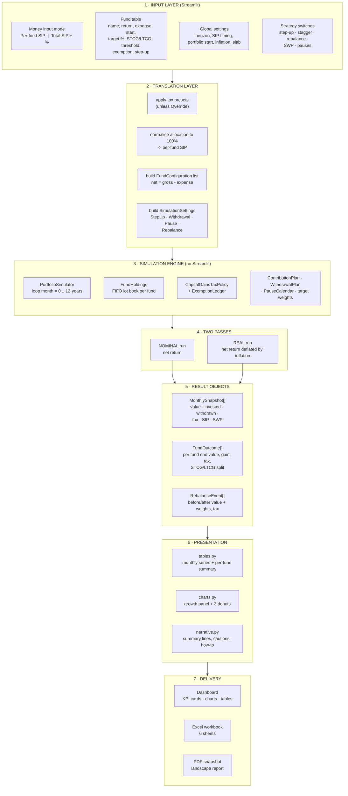
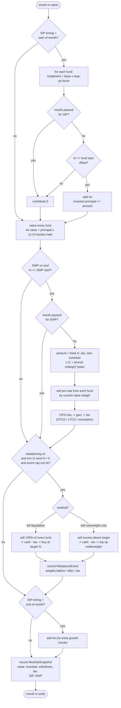
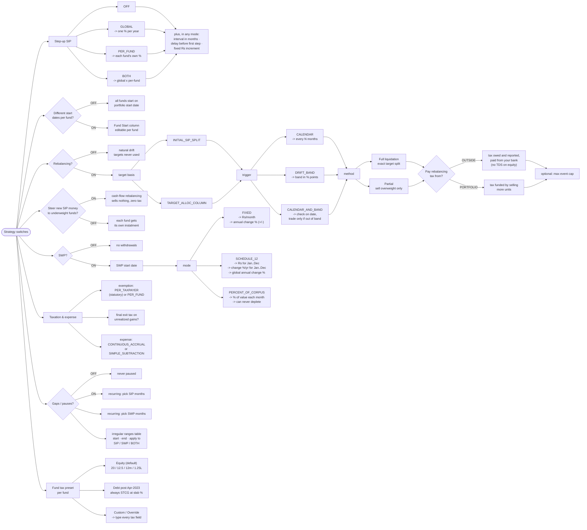
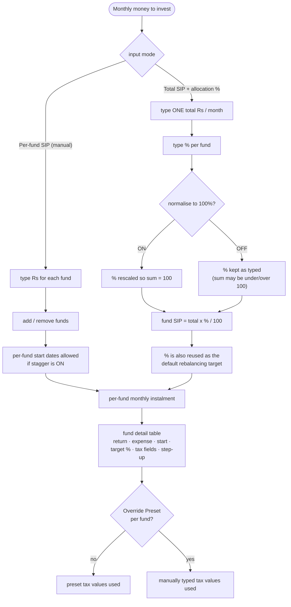
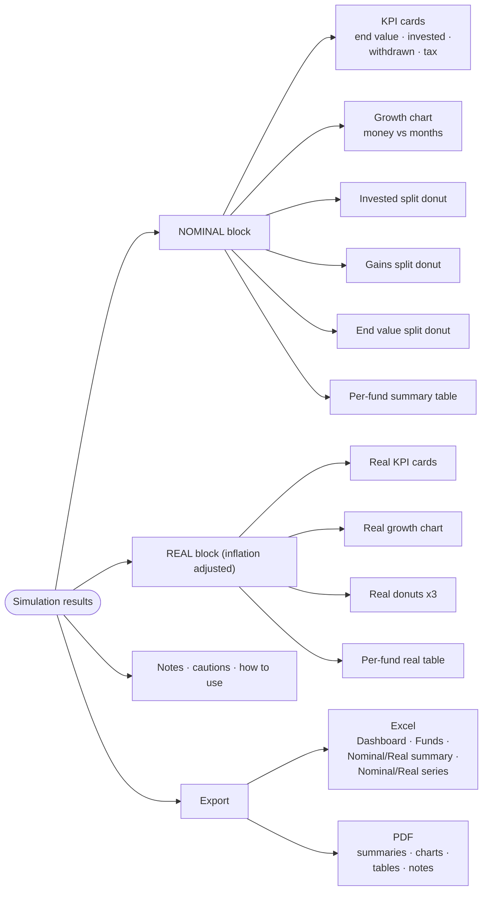
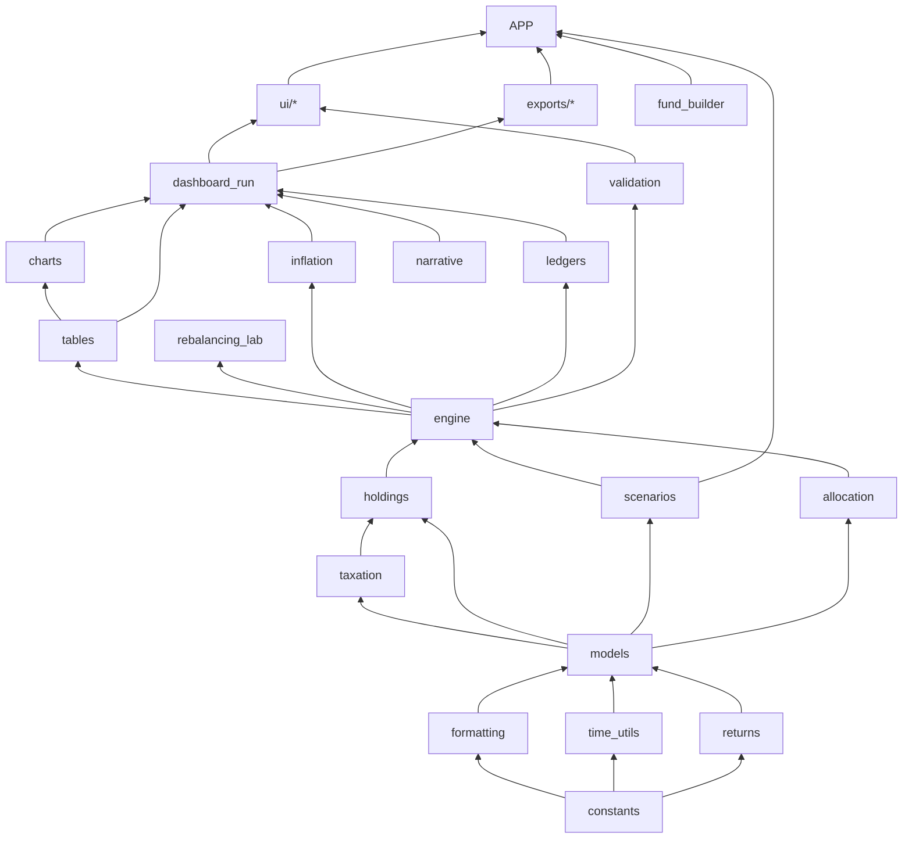

# SIP Simulator - pipeline and decision diagrams

All diagrams are Mermaid. They render in VS Code (Markdown Preview
Mermaid Support), GitHub, Obsidian and Notion.

---

## 1. End-to-end pipeline (high level)

---

## 2. What happens inside ONE simulated month

---

## 3. Toggle tree - every optional branch and its sub-inputs

---

## 4. Money input mode - the first decision

---

## 5. Output surface

---

## 6. Module dependency map (what imports what)

